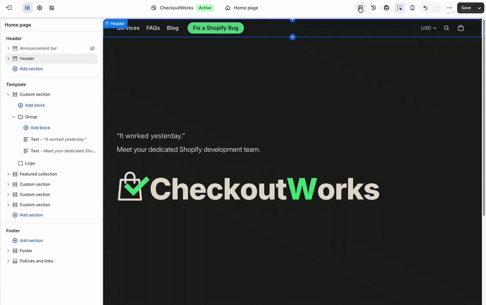
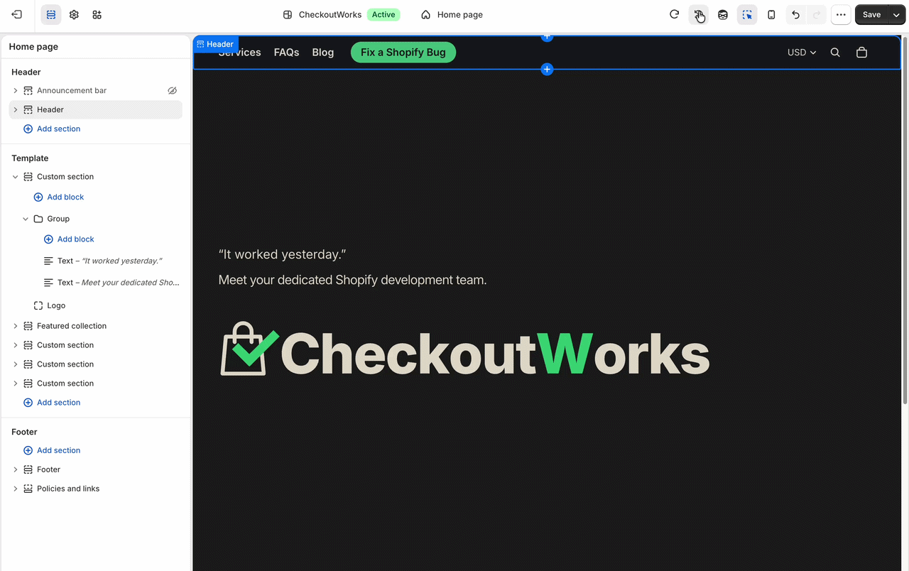

# Shopify Theme Editor Refresh Controls

An unofficial, dependency-free userscript by CheckoutWorks that adds two recovery controls to Shopify's Theme Editor:

- **Refresh storefront preview** reloads only the active preview and keeps unsaved editor changes.
- **Discard and refresh the theme editor** discards unsaved changes and restores Shopify's last saved editor state.

[Read the guide](https://checkoutworks.dev/blogs/shopify-field-notes/refresh-shopify-theme-editor-without-reloading-admin) · [Install userscript](https://github.com/CheckoutWorks/shopify-theme-editor-refresh-controls/raw/main/shopify-theme-editor-refresh-controls.user.js)

## Demo

### Refresh storefront preview

Reload the storefront preview without reloading the full Shopify Admin page.



### Discard and refresh the theme editor

Discard unsaved customizations and return to Shopify's last saved editor state.

> [!WARNING]
> **Discard and refresh the theme editor permanently removes all unsaved Theme Editor changes.**



## Installation

1. Install [Tampermonkey](https://www.tampermonkey.net/) in Google Chrome.
2. Select [Install userscript](https://github.com/CheckoutWorks/shopify-theme-editor-refresh-controls/raw/main/shopify-theme-editor-refresh-controls.user.js) and confirm the Tampermonkey prompt.
3. Open a Shopify theme through **Online Store → Themes → Customize**.

The controls appear to the left of Sidekick. Disable older development versions of this userscript if duplicate controls appear.

## How it works

- Preview refresh sends a validated message to the active design-mode storefront iframe. If it does not respond, the script uses a validated preview-only fallback.
- Discard refresh resolves Shopify's currently mounted native refresh action with language-independent structural checks. It asks for confirmation and fails closed if the action cannot be identified safely.
- The script never uses a full-page Shopify Admin reload as a fallback.

## Privacy, compatibility, and limitations

- No analytics, telemetry, tracking, persistent storage, or external runtime dependencies.
- Does not send shop data to CheckoutWorks or another third party.
- Does not reconstruct Shopify HMAC parameters or signed editor URLs.
- The `*.myshopify.com` match runs only inside Shopify design-mode preview iframes; ordinary storefront tabs exit immediately.
- Tested with Google Chrome and Tampermonkey, including English, Simplified Chinese, and Japanese Shopify Admin interfaces.
- Discard refresh restores the last saved state, not the theme's factory defaults.
- Shopify can change its private Theme Editor implementation without notice. If the native action cannot be resolved safely, the script stops and reports an error.
- The script reduces unnecessary full-page reloads but cannot guarantee that Shopify will never request authentication or human verification.

## Troubleshooting

- **Controls missing:** confirm the script is enabled, disable older versions, and reload the Theme Editor once.
- **Discard unavailable:** make an editor change first. If Shopify's conflict dialog is open, use its native refresh action.
- **Unexpected error:** check the browser console for `[Shopify Theme Editor Refresh Controls]` and [open an issue](https://github.com/CheckoutWorks/shopify-theme-editor-refresh-controls/issues).

## Development

The userscript has no build step:

```sh
node --check shopify-theme-editor-refresh-controls.user.js
node scripts/validate.mjs
```

See [CONTRIBUTING.md](./CONTRIBUTING.md), [SECURITY.md](./SECURITY.md), and [CHANGELOG.md](./CHANGELOG.md) for project details.

## License

Released under the [MIT License](./LICENSE).

Shopify is a trademark of Shopify Inc. This project is independent and is not affiliated with, endorsed by, or supported by Shopify Inc.

Built by [CheckoutWorks](https://checkoutworks.dev/), a Shopify development agency.
